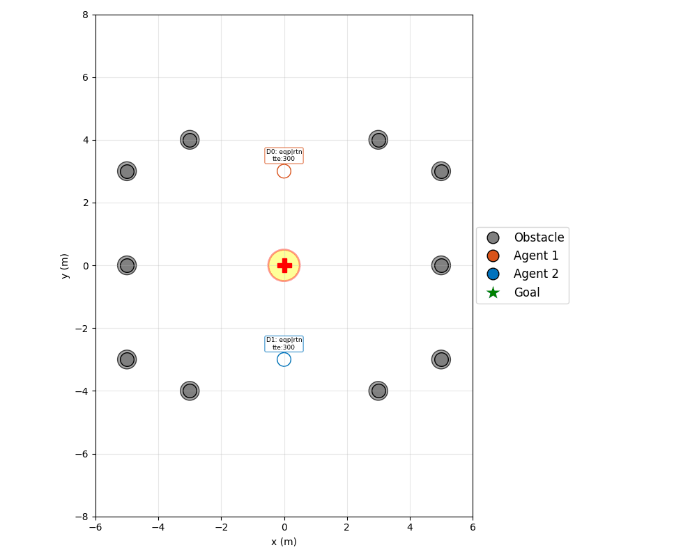
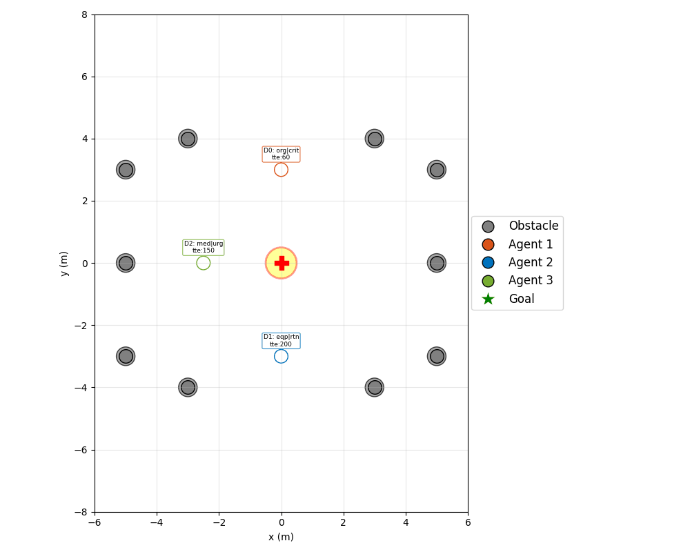
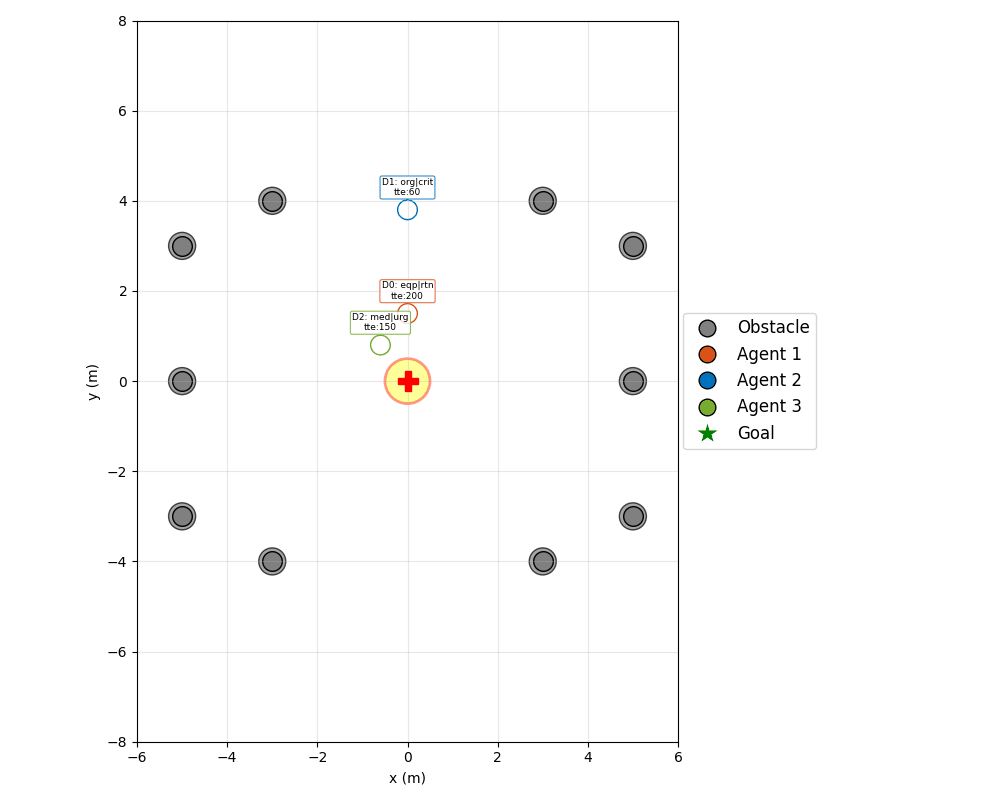
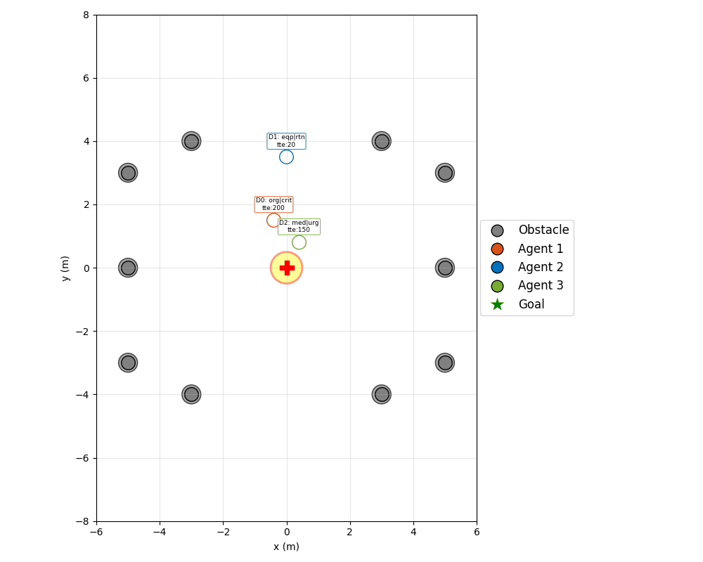
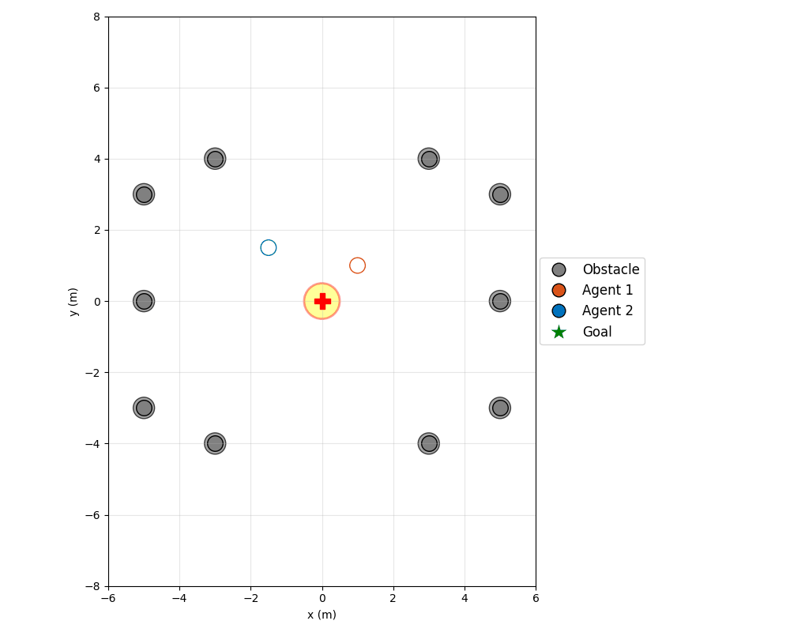

# Priority-Aware Multi-Drone Landing Pad Coordination

A fleet of hospital drones carrying time-sensitive medical cargo must share a
**single landing pad**. Only one drone can land at a time, creating a bottleneck.
This project extends the **Social-IMPC-DR** (Infinite-Horizon Model Predictive
Control with Deadlock Resolution) framework to evaluate priority-based
coordination strategies that optimize patient welfare over simple first-come
first-served policies.

---

## Quick Start

```bash
cd src/methods/Social-IMPC-DR
conda activate smglib
```

**Run Phase 1** (2 drones, closest-first):
```bash
python app2_standardized.py landing_pad configs/phase1_landing_pad.json
```

**Run Phase 2** (3 drones, priority-based):
```bash
python app2_standardized.py landing_pad configs/phase2_landing_pad.json
```

**Run Phase 3** (3 drones, orbit holding):
```bash
python app2_standardized.py landing_pad configs/phase3_orbit.json
```

**Run Phase 4 — Expiry Guard test** (rule 1: expiry override):
```bash
python app2_standardized.py landing_pad configs/phase4_expiry_guard_test.json
```

**Run Phase 4 — ETA Switch test** (rule 2: proximity tie-break):
```bash
python app2_standardized.py landing_pad configs/phase4_eta_switch_test.json
```

**Interactive mode** (manual parameter entry):
```bash
python app2_standardized.py landing_pad
```

Animations are saved to `logs/Social-IMPC-DR/animations/`.

---

## Project Architecture

```
configs/
  phase1_landing_pad.json ──┐
  phase2_landing_pad.json ──┤    Scenario configs: drone positions,
  priority_config.json ─────┤    simulation params, cargo assignments,
                            │    and priority scoring parameters.
                            ▼
app2_standardized.py        ← ENTRY POINT
  │                           Loads scenario config OR prompts user.
  │
  ├── Calls PLAN() ────────► test.py (simulation engine)
  │                            │
  │     Receives configs      │
  │     from caller.          │
  │                            ├── Creates drones ────► uav.py
  │                            │                         Position, velocity,
  │                            │                         cargo, expiry, acuity.
  │                            │
  │                            ├── Creates policy ────► LandingPadController
  │                            │      │                  or PriorityManager
  │                            │      │                  or OrbitController
  │                            │      └── Uses ───────► priority.py
  │                            │                         Scoring math.
  │                            │
  │                            └── Runs physics ──────► run.py (MPC solver)
  │                                                      Unchanged from
  │                                                      original codebase.
  │
  └── Generates animation ──► .gif / .html / .avi
```

---

## Phase 1 — Baseline Bottleneck (Completed)

**Goal:** Establish the landing pad environment with a mutual exclusion
constraint — only one drone may approach the pad at a time.

**Policy:** The **closest drone** to the pad proceeds; all others freeze in place.

**Controller:** `LandingPadController` in `landing_pad.py`

| Method | What it does |
|---|---|
| `select_active_drone()` | Picks closest active drone; others yield |
| `freeze_yielding()` | Zeros velocity for waiting drones |
| `cleanup_landed()` | Removes landed drones from the pad |
| `reset_mpc()` | Warm-start reset when a drone transitions from yielding → active |
| `update_idle_positions()` | Keeps animation aligned for frozen drones |

**Result:** 2 drones, 1 pad. Drone 0 lands at step 51, Drone 1 at step 102.
100% success rate.

**Metrics (Phase 1):**

| Metric | Value |
|---|---|
| Total delivery time | 102 steps |
| Pad idle time | 0 steps (Drone 1 starts immediately after Drone 0 lands) |
| Collision events | 0 |
| Success rate | 100% |



---

## Phase 2 — Dynamic Priority Integration (Completed)

**Goal:** Replace closest-first with a **priority scoring system** based on
medical cargo criticality.

**Policy:** The drone with the **highest priority score** proceeds. A farther
drone carrying a critical organ lands before a closer drone with routine
equipment.

**Controller:** `PriorityManager(LandingPadController)` in `priority_manager.py`

**Scoring** (`priority.py`):

| Factor | Weight | Values |
|---|---|---|
| Cargo type | 35% | organ (1.0), blood_product (0.7), medication (0.4), equipment (0.1) |
| Time to expiry | 30% | Lower remaining time → higher urgency |
| Distance to pad | 15% | Closer → higher score |
| Patient acuity | 20% | critical (1.0), urgent (0.6), routine (0.2) |

Output: `priority_score()` → float in [0, 1]

**Result:** 3 drones, mixed cargo, 1 pad.
- Drone 0 (organ/critical) lands at step 36 — highest priority
- Drone 2 (medication/urgent) lands at step 67
- Drone 1 (equipment/routine) lands at step 103
- 100% success, correct priority ordering.

**Metrics (Phase 2):**

| Metric | Value |
|---|---|
| Total delivery time | 103 steps |
| Priority inversions | 0 (correct ordering: organ → medication → equipment) |
| Weighted delivery delay | Organ delivered first despite being farther — delay minimized for highest-criticality cargo |
| Collision events | 0 |
| Success rate | 100% |



---

## Phase 3 — Holding Orbit Patterns (Completed)

**Goal:** Yielding drones fly circular holding orbits instead of freezing in
place. This makes the simulation more realistic (drones stay airborne while
waiting) and exposes the active drone's MPC to moving obstacles rather than
static ones.

**Policy:** The highest-priority drone proceeds to the pad (same as Phase 2).
All other drones enter a circular holding orbit around their current position
when told to yield.

**Controller:** `OrbitController(PriorityManager)` in `orbit_controller.py`

| Parameter | Default | Description |
|---|---|---|
| `orbit_radius` | 0.7 m | Radius of the holding circle |
| `orbit_speed` | 0.15 rad/step | Angular speed of the orbit |
| `safe_distance` | 1.2 m | Minimum gap between orbit edge and active drone |

**How it works:**
1. When a drone first enters the yield state, its current position becomes the orbit center.
2. Each step, the angle advances by `orbit_speed`. Position and velocity are set analytically (no MPC for the orbiting drone).
3. The orbiting drone's `pre_traj` is filled with its predicted future orbit positions so the active drone's MPC sees a moving obstacle and plans around it.
4. If the orbit center drifts within `orbit_radius + safe_distance` of the active drone (because the active drone flew toward it), the center is pushed outward along the repulsion vector — keeping the entire orbit ring safely clear.
5. When a drone is released from yield, orbit state is cleared and MPC is warm-started fresh.

**What is new vs the original codebase:**
The original Social-IMPC-DR uses decentralized MPC where every drone runs the
optimizer independently each step and avoids others via MBVC (Model-Based
Voronoi Constraints) — half-plane constraints at the midpoint between each pair.
There is no concept of priority or waiting. Our orbit layer sits above that:
the central controller pulls yielding drones *out* of the MPC run entirely,
moves them manually along a circle, and feeds their predicted orbit back into
the active drone's MBVC — so the original collision avoidance math still works
but now sees the right future trajectory of the orbiting drone.

**Run Phase 3:**
```bash
python app2_standardized.py landing_pad configs/phase3_orbit.json
```

**Result:** 3 drones, mixed cargo, 1 pad.
- Drone 1 (organ/critical) lands at step 41 — highest priority
- Drone 2 (medication/urgent) lands at step 71
- Drone 0 (equipment/routine) lands at step 94
- 100% success, correct priority ordering, no near-collisions.

**Metrics (Phase 3):**

| Metric | Value |
|---|---|
| Total delivery time | 94 steps |
| Priority inversions | 0 |
| Collision events | 0 |
| Success rate | 100% |
| Behavior during yield | Circular orbit (airborne) vs. frozen (Phase 1/2) |



---

## Design Discussion — Orbit vs. Hybrid Centralized-Decentralized

During Phase 3 development, two fundamentally different approaches were
considered for handling waiting drones. Both are recorded here for comparison
and future reference.

### Approach A — Centralized Orbit (Implemented)

The central controller manually computes orbit positions and velocities each
step and writes them directly to the drone's state. The MPC optimizer is
skipped entirely for yielding drones.

**Pros:**
- Exact, predictable orbit path — easy to reason about
- Full control over `pre_traj`, so the active drone's MPC always has correct predictions
- Simple to implement — no changes to the MPC solver

**Cons:**
- Yielding drones bypass the original physics — their motion is purely geometric
- Safe-distance enforcement requires a manual repulsion step (orbit center push)
- Circular path looks somewhat artificial in real deployments

### Approach B — Hybrid Centralized + Decentralized (Future candidate)

Instead of manually moving drones, the central controller only assigns each
waiting drone a **personal holding waypoint** — a reserved parking spot on
a perimeter ring around the pad. Each drone then uses its own MPC to fly
to that spot, with the original MBVC collision avoidance handling all
in-flight separation automatically.

```
Centralized layer (referee):            Decentralized layer (each drone):
  - Knows all positions & priorities      - Receives target from referee
  - Assigns pad target or perimeter       - Runs MPC to reach its target
    waypoint each step                    - Original MBVC avoids other
  - Re-assigns as drones land               drones automatically
  - Only changes target — nothing else
```

**Pros:**
- All drones stay inside the MPC physics — motion is physically consistent
- Original MBVC automatically handles separation — no manual safe-distance push needed
- Each drone flies a smooth arc to its spot (more realistic than a fixed circle)
- Centralized layer is minimal — only sets `agent.target` each step

**Cons:**
- Arrival order at the pad is not mathematically guaranteed — it depends on
  distances and MPC convergence speed; a nearby low-priority drone could reach
  its waypoint and "drift" toward the pad before the high-priority drone arrives
- Requires careful waypoint geometry — if multiple drones share the same
  perimeter ring, MPC may produce local conflicts near the waypoints
- MPC re-planning every step for all drones is more compute per step than
  skipping MPC for yielders entirely

**Why it was not implemented in Phase 3:**
The orbit approach gives a hard guarantee that only one drone is ever moving
toward the pad. Approach B trades that guarantee for physical realism. It is a
better fit for Phase 4 or 5 where the scheduler has a full time-horizon view
and can assign waypoints that provably lead to the correct landing order.

**Infrastructure already in place for Approach B:**
`agent.change_target()` is already called every step in `run_one_agent()` —
so switching a drone's destination mid-flight costs nothing architecturally.
A Phase 4 implementation only needs to compute the right waypoint per drone
and call `change_target()` on each yielder instead of `freeze_yielding()`.

---

## Scenario Configuration

Each phase is driven by a JSON config file in `configs/`. Example
(`phase2_landing_pad.json`):

```json
{
    "env_type": "landing_pad",
    "verbose": true,
    "num_moving_drones": 3,
    "min_radius": 0.5,
    "wall_collision_multiplier": 2.0,
    "epsilon": 0.1,
    "step_size": 0.1,
    "k_value": 10,
    "max_steps": 200,
    "use_priority": true,
    "drones": [
        {"start": [0.0, 3.0],  "goal": [0.0, 0.0], "cargo_type": "organ",      "time_to_expiry": 60.0,  "patient_acuity": "critical"},
        {"start": [0.0, -3.0], "goal": [0.0, 0.0], "cargo_type": "equipment",  "time_to_expiry": 200.0, "patient_acuity": "routine"},
        {"start": [-2.5, 0.0], "goal": [0.0, 0.0], "cargo_type": "medication", "time_to_expiry": 150.0, "patient_acuity": "urgent"}
    ]
}
```

| Field | Purpose |
|---|---|
| `test_name` | Output GIF filename stem (e.g. `"phase3_orbit"` → `phase3_orbit.gif`) |
| `env_type` | Environment layout (`landing_pad`, `doorway`, `hallway`, `intersection`) |
| `num_moving_drones` | Number of active drones |
| `use_priority` | `false` → Phase 1 (closest-first), `true` → Phase 2+ (priority-based) |
| `use_orbit` | `true` → Phase 3 orbit controller; requires `use_priority: true` |
| `orbit_radius` | Radius of the holding orbit circle (metres) |
| `orbit_speed` | Angular speed of the orbit (radians/step) |
| `safe_distance` | Minimum gap between orbit edge and active drone (metres) |
| `use_negotiation` | `true` → Phase 4 negotiation controller; requires `use_orbit: true` |
| `nominal_speed` | Drone speed estimate for ETA = distance / nominal_speed (m/step) |
| `eta_threshold` | Score gap below which ETA decides instead of priority rank |
| `drones` | Per-drone start/goal positions and cargo attributes |
| `min_radius` | Minimum safe distance between agents |
| `wall_collision_multiplier` | Safety margin multiplier for wall agents |
| `max_steps` | Simulation time limit |

---

## Priority Configuration

Priority scoring parameters are defined in `configs/priority_config.json`:

```json
{
    "factor_weights": {
        "cargo":    0.35,
        "expiry":   0.30,
        "distance": 0.15,
        "acuity":   0.20
    },
    "cargo_weights": {
        "organ":         1.0,
        "blood_product": 0.7,
        "medication":    0.4,
        "equipment":     0.1
    },
    "acuity_scores": {
        "critical": 1.0,
        "urgent":   0.6,
        "routine":  0.2
    },
    "max_distance": 10.0,
    "max_expiry": 300.0
}
```

| Field | Purpose |
|---|---|
| `factor_weights` | How much each factor contributes to the final score (must sum to 1.0) |
| `cargo_weights` | Categorical score per cargo type (higher = more urgent) |
| `acuity_scores` | Categorical score per patient acuity level |
| `max_distance` | Normalisation cap for the distance component |
| `max_expiry` | Normalisation cap for the expiry component |

This file is **required** — `priority.py` will print an error and exit if it is
missing. Scenario configs define *what* is being simulated; priority config
defines *how* the scoring system evaluates drones.

---

## Policy Class Hierarchy

```
LandingPadController              ← Phase 1: closest drone first
    │
    └── PriorityManager           ← Phase 2: highest priority score first
            │
            └── OrbitController   ← Phase 3: yielding drones hold circular orbits
                    │
                    └── NegotiationController  ← Phase 4: ETA + expiry guard override
                                │
                                └── (Phase 5+)  ← LLM-based negotiation
```

Each subclass only overrides the methods it changes. `test.py` calls the same
interface regardless of which controller is active. Two hooks exist for extension:

- `negotiation_hook()` — called before `select_active_drone()`. Returns `None`
  for normal behavior, or a result dict to override. Phase 4 implements expiry
  guard + ETA switch here. Phase 5 replaces this with an LLM call.
- `step_update()` — called each simulation step. Phase 2 uses it to decrement
  `time_to_expiry`. Extensible for any per-step state tracking.

---

## Phase 4 — ETA-Aware Negotiation with Expiry Enforcement (Completed)

**Goal:** Make the yielding decision smarter without changing Phases 1–3.
Instead of always enforcing strict priority rank, allow a closer lower-priority
drone to land first when the score difference is small — but override that
leniency the moment a drone is at risk of expiring before it reaches the pad.

**Controller:** `NegotiationController(OrbitController)` in `negotiation_controller.py`

**Two rules inside `negotiation_hook()`:**

1. **Expiry Guard** — if any waiting drone's `time_to_expiry` is less than its
   estimated arrival time (`distance / nominal_speed`), strict priority is enforced
   immediately. That drone will expire before it can land — it wins regardless of score.

2. **ETA Switch** — if the priority score gap between the top two drones is below
   `eta_threshold`, the drone with the shorter ETA goes first. Avoids needlessly
   delaying a nearby drone for a trivially small rank difference.

```
if any waiting drone expires before ETA:
    → Expiry Guard fires: enforce strict priority (highest score wins)
elif |score_top - score_second| < eta_threshold:
    → ETA Switch fires: closer drone goes first
else:
    → normal priority rank (same as Phase 3)
```

| Parameter | Default | Description |
|---|---|---|
| `nominal_speed` | 0.1 m/step | Used to estimate ETA = distance / nominal_speed |
| `eta_threshold` | 0.15 | Score gap below which ETA decides instead of rank |

**Run Phase 4 — Expiry Guard scenario** (equipment/routine with tte=20 overrides organ/critical):
```bash
python app2_standardized.py landing_pad configs/phase4_expiry_guard_test.json
```

**Run Phase 4 — ETA Switch scenario** (medication/urgent closer, gap=0.100 < 0.15):
```bash
python app2_standardized.py landing_pad configs/phase4_eta_switch_test.json
```

**Results:**

*Expiry Guard test:*
- Drone 1 (equipment/routine, tte=20, needs 24.6 steps) → guard fires, lands at step 35
- Drone 0 (organ/critical, tte=200) → lands at step 70
- Rule fires every 10 steps as TTE ticks down; drone 1 secures the pad before expiry

*ETA Switch test:*
- Drone 0 (medication/urgent, dist=1.41, score=0.639) vs Drone 1 (organ/critical, dist=2.12, score=0.768)
- Gap = 0.129 < 0.15 → ETA switch fires at step 20; drone 0 (closer) lands first at step 20
- Drone 1 lands at step 53

| GIF | Rule fired |
|---|---|
|  | Expiry Guard |
|  | ETA Switch |

---

## Phase 5 — LLM-Enhanced Negotiation (Planned)

**Goal:** Replace the deterministic negotiation rules from Phase 4 with an
LLM that reasons over drone state in natural language. Use this as an
**ablation study** to measure what each decision component contributes.

**Motivation:** Phase 4's two rules encode specific medical knowledge:
*"expiring cargo overrides rank"* and *"nearby drones should not wait for
trivial rank differences."* An LLM may encode richer implicit medical knowledge
and handle edge cases the rules miss — or it may not. The ablation tells us.

### Ablation Study Design

Each condition isolates one decision component by keeping everything else fixed:

| Condition | Priority Scoring | Negotiation Hook | Research question |
|---|---|---|---|
| Phase 3 | Formula (weighted) | None | Does formula-based priority work? |
| Phase 4 | Formula (weighted) | Rules (ETA + expiry) | Do rules improve over scoring alone? |
| **Phase 5-A** | Formula (weighted) | **LLM** | Can LLM replace hand-coded rules? |
| **Phase 5-B** | **LLM** | Rules (ETA + expiry) | Can LLM replace the scoring formula? |
| **Phase 5-C** | **LLM** | **LLM** | Can LLM do everything? |

If Phase 5-A ≈ Phase 4, the rules are already LLM-quality. If Phase 5-A > Phase 4,
the LLM handles edge cases the rules miss. If Phase 5-B > Phase 2/3, LLM implicit
medical domain knowledge outperforms hand-tuned weights.

### LLM as `negotiation_hook()` (Phase 5-A)

The LLM receives a structured prompt each time `negotiation_hook()` is called:

```
You are coordinating medical drone deliveries to a single landing pad.
Only one drone can land at a time. Choose which drone should land next.

Drone states (current step: {step}):
  Drone 0: cargo=medication, acuity=urgent,   distance=1.41m, ETA=14 steps, time_to_expiry=50,  score=0.639
  Drone 1: cargo=organ,      acuity=critical,  distance=2.12m, ETA=21 steps, time_to_expiry=200, score=0.768

Respond with exactly: DRONE <index> because <brief reason>
```

The LLM returns a drone index + reasoning. Falls back to Phase 4 rules on
timeout or invalid output.

### LLM as `priority_score()` (Phase 5-B)

Instead of the formula, the LLM directly ranks all drones given:
- `cargo_type`, `patient_acuity`, `time_to_expiry`, `distance_to_pad`

The LLM returns a ranked list. The controller picks the top-ranked drone as
active. This ablates the hand-tuned weights (0.35/0.30/0.15/0.20) and tests
whether LLM implicit reasoning reproduces or improves on the formula.

### What to implement

- **`llm_controller.py`** — `LLMController(NegotiationController)`
  - Override `negotiation_hook()` for Phase 5-A (LLM as negotiator)
  - Override `select_active_drone()` + `_llm_rank_drones()` for Phase 5-B (LLM as scorer)
  - LLM call with structured prompt; JSON or plain-text response parsing
  - Fallback to Phase 4 rules on timeout / parse error
  - Decision caching: re-use LLM answer for N steps to avoid per-step API calls
- **`configs/phase5_llm_hook.json`** — Phase 5-A config (`use_llm_hook: true`)
- **`configs/phase5_llm_score.json`** — Phase 5-B config (`use_llm_score: true`)
- **`configs/phase5_llm_full.json`** — Phase 5-C config (both flags)

### Evaluation Metrics

| Metric | Description | Phases |
|---|---|---|
| Priority inversion rate | How often a lower-priority drone lands before a higher-priority one | 2+ |
| Total weighted delivery delay | Sum of (priority_weight × delivery_delay) across all drones | 2+ |
| Expiry violations | Drones whose cargo expires before landing | 4+ |
| Decision consistency | How often LLM changes its choice across consecutive steps | 5 |
| LLM call frequency | API calls per simulation run (cost proxy) | 5 |
| Rule agreement rate | How often LLM agrees with Phase 4 rule-based decision | 5 |

---

## Future Extensions

### Extension A — Round-Trip Scenarios (Phase 6 candidate)

**Goal:** Drones don't just arrive — they land, unload, and depart back to
their origin, turning the pad into a **two-way bottleneck** in a continuous
delivery loop.

**Why it matters:** The current roadmap (Phases 1–5) treats the landing pad as
a finish line. Round trips test **sustained throughput** where the pad is a
temporary stop in a Source → Hospital → Source cycle.

**Feasibility:** High. The codebase already supports mid-simulation goal changes
via `uav.change_target()`. No MPC or physics changes are needed.

**What to implement:**
- Per-drone trip-state FSM: `INBOUND → LANDED → UNLOADING → OUTBOUND → DONE`
- Override `cleanup_landed()` to call `change_target(return_point)` instead of
  teleporting the drone off-screen
- Add `round_trip: true` flag and return waypoints to the scenario config
- Manage both arrival and departure queues at the pad

### Extension B — Continuous Speed Control (Phase 3/5 integration)

**Goal:** Instead of freezing yielding drones completely, modulate their flight
speed so they arrive exactly when the pad clears — replacing discrete Go/Stop
decisions with continuous velocity optimization.

**Why it matters:** In real robotics, stopping completely is energy-inefficient.
A drone told to fly at 50% speed two miles out can arrive precisely when the pad
is free, eliminating idle hover time.

**Relationship to existing phases:**
- **Phase 3** proposes circular holding orbits. Speed control is the alternative:
  slow approach instead of loitering.
- **Phase 5** proposes lookahead scheduling. Predictive speed tuning is its
  advanced form — the `SchedulerController` computes the optimal `speed_factor`
  per drone so that arrivals are sequenced without stopping.

**Feasibility:** Two tiers.

| Tier | Description | Effort |
|---|---|---|
| **A — Vmax scaling** | Set `agent.Vmax = 1.0 * speed_factor` per drone. MPC naturally plans a slower trajectory. Override `freeze_yielding()` to reduce speed instead of zeroing velocity. | Low (~30 lines) |
| **B — Predictive arrival** | `SchedulerController` estimates pad clearance time, computes required speed factor per drone so `ETA == pad_clear_time`. Re-solves every N steps. | Medium-high (~400-500 lines) |

> **Note:** `Vmax` is a ceiling, not a target — the MPC may fly slower than the
> cap due to collision avoidance or terminal constraints. Tier B would need
> iterative tuning or a two-layer optimizer (scheduler sets Vmax, MPC executes).

---

## File Reference

| File | Status | Purpose |
|---|---|---|
| `app2_standardized.py` | Modified | Entry point — config-file mode or interactive mode |
| `test.py` | Modified | Simulation engine — delegates to controllers |
| `uav.py` | Modified | Drone data object — added cargo/priority attributes |
| `run.py` | Modified | MPC solver — fixed hardcoded index threshold |
| `avoid.py` | Modified | Collision constraints — wall multiplier support |
| `SET.py` | Modified | Global params — added `num_moving_drones`, `ENV_TYPE` |
| `landing_pad.py` | New | Phase 1 controller — mutual exclusion, yielding |
| `priority.py` | New | Scoring math — `priority_score()`, `rank_drones()` |
| `priority_manager.py` | New | Phase 2 controller — priority-based policy |
| `test_phase2.py` | New | Standalone Phase 2 test script |
| `orbit_controller.py` | New | Phase 3 controller — circular orbit holding |
| `negotiation_controller.py` | New | Phase 4 controller — ETA + expiry guard negotiation |
| `configs/*.json` | New | Scenario configs and priority scoring parameters |
| `src/utils.py` | Modified | Added `landing_pad` environment type |

---

## Environment Setup

```bash
conda create -n smglib python=3.10
conda activate smglib
pip install -r requirements.txt   # cvxpy, numpy, matplotlib, scipy
```
