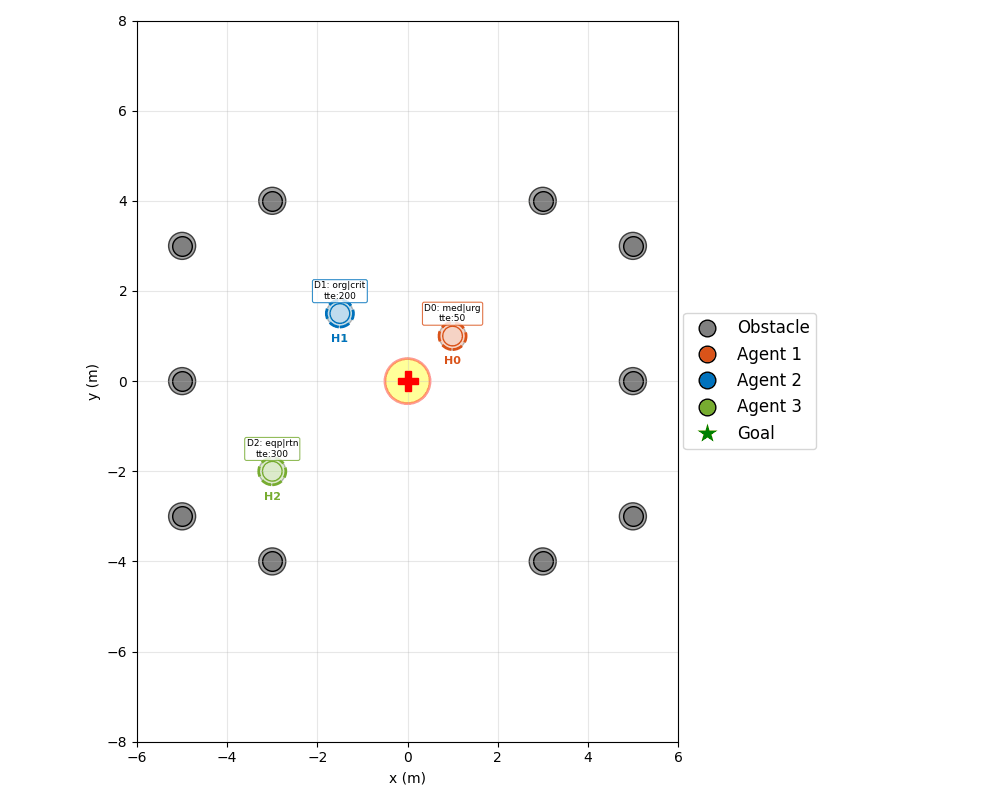
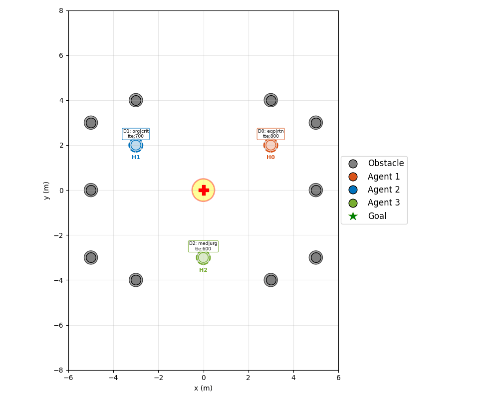

# Social-IMPC-DR — Track 2 (Trajectory Planner)

This branch implements **planner-based simultaneous inbound flight** for a
shared medical landing pad. Instead of choosing a single winner and
forcing the rest to yield (the Track 1 model), the planner computes a
per-drone cruise speed cap so all drones fly at the same time and arrive
at the pad in priority order with safe spacing.

The single-winner / yielding family (closest-first, priority, orbit,
ETA/expiry negotiation) is **not** included here — it lives in
`research/track-policy-yield`.

---

## 1. Setup

### 1.1 Prerequisites

- Python 3.10
- Conda (Miniconda/Anaconda)

### 1.2 Environment

```bash
conda create -n smglib python=3.10
conda activate smglib
```

### 1.3 Install dependencies

```bash
cd src/methods/Social-IMPC-DR
pip install -r requirements.txt
```

`requirements.txt` pins:

- `cvxpy==1.6.0` — MPC solver
- `numpy==2.2.3`, `scipy==1.15.2` — numerics
- `matplotlib==3.10.0` — animation rendering
- `opencv-python==4.11.0.86`, `PyQt5==5.15.11` — display utilities

### 1.4 Quick verification

Run the planner one-way scenario to confirm the install:

```bash
python app2_standardized.py landing_pad configs/track_trajectory_oneway.json
```

A GIF is written to `logs/Social-IMPC-DR/animations/`.

---

## 2. Method

### 2.1 Setting

A landing pad sits at a fixed location. Multiple drones converge on it
to deliver cargo. Unlike Track 1, all drones fly **at the same time**;
the planner shapes their speeds so arrivals happen sequentially with
guaranteed spacing.

### 2.2 Speed-scaling formula

Drones are ranked by priority score (highest first). For drone `k` with
distance `d_k` to the pad, given the previous drone’s arrival time
`T_{k-1}` and assigned speed `v_{k-1}`, the planner computes:

```
T_arrive_k = max(
    d_k / max_speed,                              # physical floor
    T_{k-1} + unload_steps,                       # pad-clearance floor
    T_{k-1} + min_separation / v_{k-1},           # spatial-separation floor
)
v_k        = min(d_k / T_arrive_k, max_speed)
```

The top-ranked drone gets `T_arrive_1 = d_1 / max_speed` (full speed,
unconstrained). Each subsequent drone’s arrival ratchets forward.

`OUTBOUND` drones (returning home after a delivery) are restored to
`max_speed` — they do not contend with the inbound queue.

### 2.3 Replanning

The planner re-runs whenever the inbound set changes:

- A drone lands and starts unloading (`INBOUND -> UNLOADING`).
- A drone leaves the pad heading home (`UNLOADING -> OUTBOUND`).
- A drone re-enters the inbound queue (`OUTBOUND -> INBOUND`,
  round-trip mode).

This keeps the schedule consistent across the lifecycle.

### 2.4 Pad-busy safety net

Even with a feasible schedule, MPC overshoot or local collision
avoidance can drift an inbound drone toward the pad while another is
still unloading. As a guard:

- If any drone is `UNLOADING`, every inbound drone whose distance to
  the pad falls below `safe_distance` is frozen for that step.

This is a safety net, not a steady-state mechanism. With a feasible
`max_speed` / `min_separation` / `unload_steps`, it should rarely fire.

### 2.5 Lifecycle FSM (built into the planner)

The planner owns the round-trip lifecycle directly:

```
INBOUND  -> UNLOADING -> OUTBOUND -> (next inbound)  ... -> DONE
```

- One-way scenarios: set `n_trips = 1` (drones land, unload, fly home,
  finish).
- Round-trip scenarios: set `n_trips >= 2` (drones repeat the loop).

The home-pad rendering hint is only stamped onto each `uav` when
`n_trips >= 2`, so one-way scenarios don't draw a redundant home-pad
circle on top of the start-square marker. Internal logic still uses
`return_points` for the OUTBOUND leg in both cases.

---

## 3. Implementation

### 3.1 File layout

```
src/methods/Social-IMPC-DR/
├── trajectory_planner_controller.py   # the entire Track 2 controller:
│                                      #   speed-scaling planner + Vmax push
│                                      #   round-trip lifecycle FSM
│                                      #   target swapping, TTE countdown,
│                                      #   home-pad rendering hint
├── landing_pad.py                     # MPC-side plumbing (cleanup helpers,
│                                      #   freeze_yielding, reset_mpc, ...)
├── priority.py                        # weighted medical priority score
├── app2_standardized.py               # entry point: scenario JSON or interactive
├── test.py                            # simulation loop, controller selection
├── configs/
│   ├── track_trajectory_oneway.json     # one-way planner scenario
│   ├── track_trajectory_round_trip.json # round-trip planner scenario
│   └── priority_config.json           # priority weights, cargo/acuity scores
└── (MPC core: run.py, avoid.py, uav.py, SET.py, others.py, plot.py, ...)
```

The MPC core (`run.py`, `avoid.py`, `uav.py`, `SET.py`, `dynamic.py`) is
unchanged from upstream Social-IMPC-DR.

Removed from this branch (vs. the historical Phase 1-6 chain):

- `priority_manager.py`, `orbit_controller.py`, `negotiation_controller.py`,
  `llm_controller.py` — single-winner / yield / orbit family. Lives on
  `research/track-policy-yield`.
- `round_trip_controller.py` — the FSM was inlined into
  `trajectory_planner_controller.py` so Track 2 ships a single,
  self-contained controller.

### 3.2 Controller class structure

```
LandingPadController              (MPC plumbing: cleanup_landed defaults,
                                   freeze_yielding, reset_mpc, get_released_drones,
                                   update_idle_positions, step_update)
  └─ TrajectoryPlannerController  (speed-scaling planner +
                                   round-trip FSM (INBOUND→UNLOADING→OUTBOUND→DONE) +
                                   target swapping, TTE countdown,
                                   home-pad rendering hint)
```

`TrajectoryPlannerController` is a single, flat class on top of the
landing-pad base. It overrides:

- `select_active_drone(...)` — instead of picking one winner, returns
  `{ allowed: None, yielding: <near-pad drones during pad-busy>, method: "planner" }`,
  calling `_replan(...)` whenever the inbound set changes.
- `_replan(...)` — internal: scores inbound drones, ranks them, and
  assigns `T_arrive` and `Vmax` per the speed-scaling formula. Pushes
  `Vmax` directly to each `uav` so MPC enforces it.
- `cleanup_landed(...)` — runs FSM transitions on each drone that just
  reached its current target (`INBOUND→UNLOADING`, `OUTBOUND→INBOUND/DONE`).
- `step_update(...)` — TTE countdown for cargo-aware priority scoring,
  unload-timer countdown, dispatches OUTBOUND when unload finishes.
- `all_finished(...)` — terminates only when every drone is `DONE`
  (completed all `n_trips`).

### 3.3 Data flow (per simulation step)

```
test.PLAN(...)
  └─ controller.cleanup_landed             ─► FSM transitions, mark dirty
  └─ controller.select_active_drone        ─► may call _replan(...)
        └─ filter inbound (state == INBOUND)
        └─ if dirty or inbound set changed: _replan
            ├─ priority_score per drone
            ├─ rank, assign T_arrive + Vmax
            ├─ push Vmax into agent_list[j].Vmax
            └─ OUTBOUND drones get full max_speed
        └─ pad-busy safety net (freeze near-pad drones)
  └─ controller.freeze_yielding            ─► safety-net only; freezes near-pad inbound
  └─ run_one_step (MPC) for non-yielding drones
  └─ controller.update_idle_positions
  └─ controller.step_update                ─► FSM transitions, mark dirty
  └─ controller.all_finished               ─► termination check
```

### 3.4 Wiring in `test.py`

Track 2 has exactly one dispatch path:

- `env_type: 'landing_pad'` + `use_trajectory_planner: true` + `cargo_configs`
  → `TrajectoryPlannerController(...)`
- anything else under `landing_pad` → raises `ValueError`. Track 2 has
  no yield/orbit/negotiation fallback (use `research/track-policy-yield`
  for those scenarios).

`app2_standardized.py` parses the scenario JSON, builds
`round_trip_params` (the planner's full knob set: `max_speed`,
`min_separation`, `n_trips`, `unload_steps`, `safe_distance`,
`nominal_speed`, plus per-drone `return_points`), and tags the output
GIF as `planner`.

---

## 4. Run

### 4.1 Available scenarios

| Config file                          | What it exercises                                  |
|--------------------------------------|----------------------------------------------------|
| `track_trajectory_oneway.json`       | 3 drones, simultaneous flight, single delivery     |
| `track_trajectory_round_trip.json`   | 3 drones, 2 trips each, full Source → Pad → Source loop |

Each GIF below is the output of running the matching config from
section 4.2. Paths are relative to this README; on GitHub they render
inline.

**`track_trajectory_oneway`** — 3 drones cruise simultaneously; the
planner caps each drone's `Vmax` so arrivals are sequenced by priority
with `min_separation` spacing. Each drone returns to its start once
unloaded (no home-pad markers because `n_trips == 1`).



**`track_trajectory_round_trip`** — same planner but `n_trips = 2`
per drone. Drones replan whenever the inbound set changes
(`INBOUND → UNLOADING`, `UNLOADING → OUTBOUND`, `OUTBOUND → INBOUND`).
Per-drone home pads (dashed circles) mark each shuttle's return point.



### 4.2 Commands

```bash
cd src/methods/Social-IMPC-DR
conda activate smglib

# One-way planner scenario
python app2_standardized.py landing_pad configs/track_trajectory_oneway.json

# Round-trip planner scenario
python app2_standardized.py landing_pad configs/track_trajectory_round_trip.json
```

Outputs (per run):

- `logs/Social-IMPC-DR/animations/<test_name>.gif`
- `avg_delta_velocity_robot_*.csv`, `path_deviation_robot_*.csv`,
  `ttg_impc_dr.csv`, `completion_step.txt` in the run directory

Verbose console output includes a periodic schedule dump:

```
[Planner] step 1 schedule -> D2: v=0.367 T=10.0, D0: v=0.071 T=20.0, ...
```

---

## 5. Scenario configuration

Example (`configs/track_trajectory_oneway.json`):

```json
{
    "test_name": "track_trajectory_oneway",
    "env_type": "landing_pad",
    "verbose": true,
    "num_moving_drones": 3,
    "max_steps": 600,
    "use_priority": true,
    "use_trajectory_planner": true,
    "n_trips": 1,
    "unload_steps": 5,
    "max_speed": 1.0,
    "min_separation": 1.0,
    "safe_distance": 1.2,
    "nominal_speed": 0.1,
    "drones": [
        { "start": [ 1.0,  1.0], "goal": [0.0, 0.0],
          "cargo_type": "medication", "time_to_expiry": 50.0,  "patient_acuity": "urgent" },
        { "start": [-1.5,  1.5], "goal": [0.0, 0.0],
          "cargo_type": "organ",      "time_to_expiry": 200.0, "patient_acuity": "critical" },
        { "start": [-3.0, -2.0], "goal": [0.0, 0.0],
          "cargo_type": "equipment",  "time_to_expiry": 300.0, "patient_acuity": "routine" }
    ]
}
```

### 5.1 Planner-specific fields

| Field                      | Purpose                                                  |
|----------------------------|----------------------------------------------------------|
| `use_trajectory_planner`   | Must be `true` to activate `TrajectoryPlannerController` |
| `max_speed`                | Hard speed ceiling for any drone                         |
| `min_separation`           | Minimum spatial gap floor between consecutive arrivals   |
| `unload_steps`             | Pad occupancy time after a landing                       |
| `safe_distance`            | Pad-busy safety-net threshold                            |
| `nominal_speed`            | Reserved for future planner extensions                   |
| `n_trips`                  | `1` for one-way, `>=2` for round-trip                    |
| `use_priority`             | Required so cargo metadata is loaded into the drones     |

The legacy `use_orbit` and `use_negotiation` flags from the Phase 1-6
chain are no longer recognised on this branch — the orbit/negotiation
controllers were removed. Use `research/track-policy-yield` for those
scenarios.

### 5.2 Per-drone fields

| Field                      | Purpose                                                  |
|----------------------------|----------------------------------------------------------|
| `start`                    | Initial 2D position                                      |
| `goal`                     | Pad position (`[0, 0]`)                                  |
| `return_point`             | Round-trip only: home pad to fly back to                 |
| `cargo_type`               | `organ` / `blood_product` / `medication` / `equipment`   |
| `time_to_expiry`           | Steps before cargo expires (used by priority score)      |
| `patient_acuity`           | `critical` / `urgent` / `routine`                        |

### 5.3 Scenario-level fields

| Field                       | Purpose                                                  |
|-----------------------------|----------------------------------------------------------|
| `test_name`                 | Used for the output GIF filename                         |
| `env_type`                  | Must be `landing_pad` for this track                     |
| `num_moving_drones`         | Number of moving drones                                  |
| `max_steps`                 | Episode length cap                                       |
| `min_radius`, `epsilon`, `step_size`, `k_value`, `wall_collision_multiplier` | Underlying MPC/environment parameters                    |
| `drones`                    | Per-drone settings (see 5.2)                             |

---

## 6. Relation to other track

- This branch implements **Track 2 only** (trajectory planner family).
- Yield/orbit/negotiation work (single-winner discrete coordination)
  lives in `research/track-policy-yield`.
- LLM extensions for either track go on dedicated child branches; see
  `LLM_BRANCH_BOOTSTRAP.md` (in `dev/jinyoon` / Track 1 history) for the
  shared bootstrap notes.
