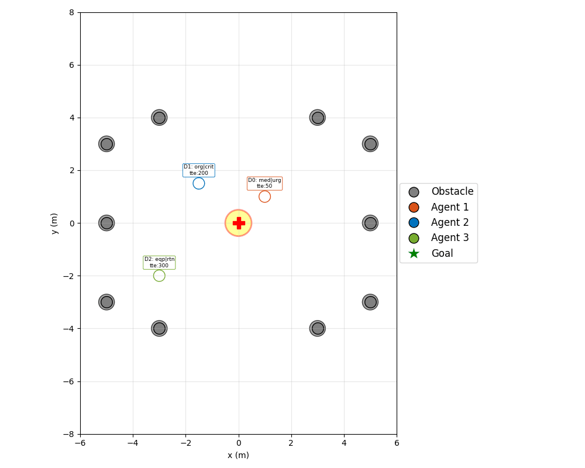

# Medical Drone Landing-Pad Coordination

This document explains our medical drone landing-pad coordination project
built on top of the original Social-IMPC-DR method. The original upstream-style
README is kept in `README.md`; this guide describes the new landing-pad tracks,
configs, commands, and generated outputs.

This project extends Social-IMPC-DR with a shared medical landing-pad scenario.
The extension keeps the original simulation core, then adds two track-specific
coordination modules:

- **Track 1: Yield Control** uses a single-winner landing-pad policy. One
  drone is allowed to approach the pad while the others yield by freezing or
  orbiting. The selector, yielder, lifecycle, and negotiators are peer plugins
  under `yield_control/`.
- **Track 2: Trajectory Planner** keeps all inbound drones moving together.
  The planner computes per-drone cruise speed caps so arrivals happen in
  priority order with safe spacing.

Users choose the track from the command line: `yield_control` for Track 1 or
`trajectory_planner <mode>` for Track 2. The landing-pad environment is still
used internally by both tracks.

---

## 1. Setup

### 1.1 Prerequisites

- Python 3.10
- Conda (Miniconda/Anaconda)

### 1.2 Environment

```bash
conda create -n smglib python=3.10
conda activate smglib
```

### 1.3 Install dependencies

```bash
cd src/methods/Social-IMPC-DR
pip install -r requirements.txt
```

`requirements.txt` pins:

- `cvxpy==1.6.0` — MPC solver
- `numpy==2.2.3`, `scipy==1.15.2` — numerics
- `matplotlib==3.10.0` — animation rendering
- `opencv-python==4.11.0.86`, `PyQt5==5.15.11` — display utilities

### 1.4 Quick verification

Run one scenario from either track to confirm the install:

```bash
python app2_standardized.py trajectory_planner baseline configs/trajectory_planner/baseline_oneway.json
python app2_standardized.py yield_control configs/yield_control/baseline_closest.json
```

A GIF is written to `logs/Social-IMPC-DR/animations/`.

---

## 2. Methods

### 2.1 Shared setting

A landing pad sits at a fixed location. Multiple drones converge on it
to deliver cargo. Both tracks use the same MPC/environment code, cargo
metadata, priority score, standardized configs, and animation renderer.

### 2.2 Track 1: Yield Control

Track 1 makes a discrete per-step decision:

```python
{"allowed": int | None, "yielding": set[int], "method": str, "scores": dict[int, float]}
```

The `yield_control/` package composes one component per role:

- `selector`: `closest_first`, `priority`
- `yielder`: `freeze`, `orbit`
- `lifecycle`: `one_way`, `round_trip`
- `negotiator`: `expiry_guard`, `eta_switch`, `llm_negotiator`

The `llm_negotiator` plugin adapts Shariq's Phase 5 LLM work into the new
recipe format while preserving the original internal method names such as
`negotiation_hook`, `_score_active`, `_build_prompt`, `_call_llm`, and
`print_llm_summary`.

### 2.3 Track 2: Speed-scaling trajectory planner

Drones are ranked by priority score (highest first). For drone `k` with
distance `d_k` to the pad, given the previous drone’s arrival time
`T_{k-1}` and assigned speed `v_{k-1}`, the planner computes:

```
T_arrive_k = max(
    d_k / max_speed,                              # physical floor
    T_{k-1} + unload_steps,                       # pad-clearance floor
    T_{k-1} + min_separation / v_{k-1},           # spatial-separation floor
)
v_k        = min(d_k / T_arrive_k, max_speed)
```

The top-ranked drone gets `T_arrive_1 = d_1 / max_speed` (full speed,
unconstrained). Each subsequent drone’s arrival ratchets forward.

`OUTBOUND` drones (returning home after a delivery) are restored to
`max_speed` — they do not contend with the inbound queue.

### 2.4 Replanning

The planner re-runs whenever the inbound set changes:

- A drone lands and starts unloading (`INBOUND -> UNLOADING`).
- A drone leaves the pad heading home (`UNLOADING -> OUTBOUND`).
- A drone re-enters the inbound queue (`OUTBOUND -> INBOUND`,
  round-trip mode).

This keeps the schedule consistent across the lifecycle.

### 2.5 Pad-busy safety net

Even with a feasible schedule, MPC overshoot or local collision
avoidance can drift an inbound drone toward the pad while another is
still unloading. As a guard:

- If any drone is `UNLOADING`, every inbound drone whose distance to
  the pad falls below `safe_distance` is frozen for that step.

This is a safety net, not a steady-state mechanism. With a feasible
`max_speed` / `min_separation` / `unload_steps`, it should rarely fire.

### 2.6 Lifecycle FSM

Both tracks support the same high-level round-trip lifecycle:

```
INBOUND  -> UNLOADING -> OUTBOUND -> (next inbound)  ... -> DONE
```

- Policy/yield scenarios choose `"lifecycle": "round_trip"` inside the
  `policy` recipe.
- Planner scenarios set `n_trips = 1` for one delivery or `n_trips >= 2`
  for shuttle/round-trip behavior.

The home-pad rendering hint is only stamped onto each `uav` in true
shuttle scenarios, so one-way scenarios do not draw redundant home-pad
circles around the start markers.

---

## 3. Implementation

### 3.1 File layout

```
src/methods/Social-IMPC-DR/
├── yield_control/                      # Track 1 plugin package:
│   ├── controller.py                    #   PolicyYieldController orchestrator
│   ├── registry.py                      #   recipe builder and plugin lookup
│   ├── selectors.py                     #   closest_first, priority
│   ├── yielders.py                      #   freeze, orbit
│   ├── lifecycles.py                    #   one_way, round_trip
│   ├── negotiators.py                   #   expiry_guard, eta_switch, llm_negotiator
│   └── context.py                       #   per-step Context dataclass
├── trajectory_planner/                 # Track 2 planner package:
│   ├── baseline.py                     #   current working planner
│   ├── llm_advisor.py                  #   optional explanation helper
│   ├── llm_method.py                   #   placeholder for Shariq's method
│   ├── lookahead.py                    #   Leonardo finite-horizon planner
│   └── registry.py                     #   baseline/llm/lookahead/compare_all
├── trajectory_planner_controller.py    # compatibility import
├── llm_advisor.py                      # compatibility import
├── landing_pad.py                     # MPC-side plumbing (cleanup helpers,
│                                      #   freeze_yielding, reset_mpc, ...)
├── priority.py                        # weighted medical priority score
├── app2_standardized.py               # entry point: scenario JSON or interactive
├── test.py                            # shared simulation loop, track dispatch
├── configs/
│   ├── yield_control/*.json              # Track 1 policy/yield scenarios
│   ├── trajectory_planner/baseline_oneway.json     # one-way planner scenario
│   ├── trajectory_planner/baseline_round_trip.json # round-trip planner scenario
│   ├── trajectory_planner/llm_explain.json # planner + explanation-only LLM advisor
│   ├── trajectory_planner/lookahead_oneway.json # Leonardo lookahead planner scenario
│   └── priority_config.json           # priority weights, cargo/acuity scores
└── (MPC core: run.py, avoid.py, uav.py, SET.py, others.py, plot.py, ...)
```

The MPC core (`run.py`, `avoid.py`, `uav.py`, `SET.py`, `dynamic.py`) is
unchanged from upstream Social-IMPC-DR.

Historical Phase-era controller subclasses are not restored in the
combined branch:

- `priority_manager.py`, `orbit_controller.py`, `negotiation_controller.py`,
  `llm_controller.py` — replaced by the flat `yield_control/` plugin
  package for Track 1.
- `round_trip_controller.py` — the FSM was inlined into
  `trajectory_planner/baseline.py` so Track 2 ships a single,
  self-contained controller.

### 3.2 Controller class structure

```
LandingPadController              (MPC plumbing: cleanup_landed defaults,
                                   freeze_yielding, reset_mpc, get_released_drones,
                                   update_idle_positions, step_update)
  └─ TrajectoryPlannerController  (speed-scaling planner +
                                   round-trip FSM (INBOUND→UNLOADING→OUTBOUND→DONE) +
                                   target swapping, TTE countdown,
                                   home-pad rendering hint)
       └─ uses TrajectoryLLMAdvisor (optional; no controller inheritance)
```

`TrajectoryPlannerController` is a single, flat class on top of the
landing-pad base. It overrides:

- `select_active_drone(...)` — instead of picking one winner, returns
  `{ allowed: None, yielding: <near-pad drones during pad-busy>, method: "planner" }`,
  calling `_replan(...)` whenever the inbound set changes.
- `_replan(...)` — internal: scores inbound drones, ranks them, and
  assigns `T_arrive` and `Vmax` per the speed-scaling formula. Pushes
  `Vmax` directly to each `uav` so MPC enforces it.
- `cleanup_landed(...)` — runs FSM transitions on each drone that just
  reached its current target (`INBOUND→UNLOADING`, `OUTBOUND→INBOUND/DONE`).
- `step_update(...)` — TTE countdown for cargo-aware priority scoring,
  unload-timer countdown, dispatches OUTBOUND when unload finishes.
- `all_finished(...)` — terminates only when every drone is `DONE`
  (completed all `n_trips`).

`TrajectoryLLMAdvisor` in `trajectory_planner/llm_advisor.py` is deliberately a helper, not
a controller subclass. It adapts the useful pieces from the older Phase 5
LLM work (API call, prompt construction, response parsing, caching, and
summary logging) without bringing back `PriorityManager`,
`OrbitController`, `NegotiationController`, or `LLMController`.

The first supported mode is `llm_mode: "explain"`: the planner computes
the normal schedule, then the advisor asks the LLM to explain the medical
reasoning and expiry risk. It does not change scores, arrival times,
speed caps, or target switching. A `score_adjust` path exists in the
helper for future behavior-changing experiments, but the shipped config
starts with explanation-only mode.

### 3.3 Data flow (per simulation step)

```
test.PLAN(...)
  └─ controller.cleanup_landed             ─► FSM transitions, mark dirty
  └─ controller.select_active_drone        ─► may call _replan(...)
        └─ filter inbound (state == INBOUND)
        └─ if dirty or inbound set changed: _replan
            ├─ priority_score per drone
            ├─ optional LLM score adjustment (future mode)
            ├─ rank, assign T_arrive + Vmax
            ├─ push Vmax into agent_list[j].Vmax
            ├─ optional LLM schedule explanation (explain mode)
            └─ OUTBOUND drones get full max_speed
        └─ pad-busy safety net (freeze near-pad drones)
  └─ controller.freeze_yielding            ─► safety-net only; freezes near-pad inbound
  └─ run_one_step (MPC) for non-yielding drones
  └─ controller.update_idle_positions
  └─ controller.step_update                ─► FSM transitions, mark dirty
  └─ controller.all_finished               ─► termination check
```

### 3.4 Wiring in `test.py`

The final branch has two landing-pad dispatch paths:

- command `trajectory_planner <mode>` + `use_trajectory_planner: true`
  → `TrajectoryPlannerController(...)`
- command `yield_control` + a `policy` block
  → `build_policy_yield_controller(...)`
- `landing_pad` remains the internal environment for both tracks.

`app2_standardized.py` parses the scenario JSON and builds either
`policy_recipe` or `round_trip_params`. Output GIFs are tagged from the
scenario `test_name`, so Track 1 and Track 2 outputs do not overwrite
each other.

---

## 4. Run

### 4.1 Available scenarios

| Config file                                       | Track | What it exercises                                  |
|---------------------------------------------------|-------|----------------------------------------------------|
| `yield_control/baseline_closest.json`              | 1     | `closest_first` + `freeze` + `one_way`             |
| `yield_control/priority.json`                      | 1     | medical priority selector + hysteresis             |
| `yield_control/orbit_hold.json`                    | 1     | orbit yielder                                      |
| `yield_control/negotiation.json`                   | 1     | priority/ETA negotiation recipe                    |
| `yield_control/negotiation_no_hysteresis.json`     | 1     | negotiation without held winner                    |
| `yield_control/negotiation_expiry_guard.json`      | 1     | expiry override negotiator                         |
| `yield_control/negotiation_eta_switch.json`        | 1     | ETA switch negotiator                              |
| `yield_control/round_trip.json`                    | 1     | policy/yield round-trip lifecycle                  |
| `yield_control/llm_negotiator.json`                | 1     | Shariq-style LLM negotiator plugin                 |
| `trajectory_planner/baseline_oneway.json`                    | 2     | simultaneous flight, single delivery               |
| `trajectory_planner/baseline_round_trip.json`                | 2     | 2 trips each, full Source -> Pad -> Source loop    |
| `trajectory_planner/llm_explain.json`               | 2     | planner plus explanation-only LLM advisor          |
| `trajectory_planner/lookahead_oneway.json`          | 2     | Leonardo finite-horizon lookahead planner          |

Each GIF below is the output of running the matching config from
section 4.2. Paths are relative to this README; on GitHub they render
inline.

**`trajectory_planner_baseline_oneway`** — 3 drones cruise simultaneously; the
planner caps each drone's `Vmax` so arrivals are sequenced by priority
with `min_separation` spacing. Each drone returns to its start once
unloaded (no home-pad markers because `n_trips == 1`).



**`trajectory_planner_baseline_round_trip`** — same planner but `n_trips = 2`
per drone. Drones replan whenever the inbound set changes
(`INBOUND → UNLOADING`, `UNLOADING → OUTBOUND`, `OUTBOUND → INBOUND`).
Per-drone home pads (dashed circles) mark each shuttle's return point.


Track 1 animations are also included under
`logs/Social-IMPC-DR/animations/yield_control/`.

### 4.2 Commands

```bash
cd src/methods/Social-IMPC-DR
conda activate smglib

# Baseline planner scenario (current Jinyoon method)
python app2_standardized.py trajectory_planner baseline configs/trajectory_planner/baseline_oneway.json

# Round-trip planner scenario
python app2_standardized.py trajectory_planner baseline configs/trajectory_planner/baseline_round_trip.json

# Shariq LLM advisor/explanation mode
python app2_standardized.py trajectory_planner llm configs/trajectory_planner/llm_explain.json

# Leonardo finite-horizon lookahead planner
python app2_standardized.py trajectory_planner lookahead configs/trajectory_planner/lookahead_oneway.json

# Comparison entry point; currently uses the registry behavior for available modes
python app2_standardized.py trajectory_planner compare_all configs/trajectory_planner/baseline_oneway.json

# Yield-control baseline
python app2_standardized.py yield_control configs/yield_control/baseline_closest.json

# Yield-control + LLM negotiator
python app2_standardized.py yield_control configs/yield_control/llm_negotiator.json
```

Outputs (per run):

- `logs/Social-IMPC-DR/animations/<track>/<test_name>.gif`
- `avg_delta_velocity_robot_*.csv`, `path_deviation_robot_*.csv`,
  `ttg_impc_dr.csv`, `completion_step.txt` in the run directory

Verbose console output includes a periodic schedule dump:

```
[Planner] step 1 schedule -> D2: v=0.367 T=10.0, D0: v=0.071 T=20.0, ...
```

---

## 5. Scenario configuration

Example (`configs/trajectory_planner/baseline_oneway.json`):

```json
{
    "test_name": "trajectory_planner_baseline_oneway",
    "env_type": "landing_pad",
    "verbose": true,
    "num_moving_drones": 3,
    "max_steps": 600,
    "use_priority": true,
    "use_trajectory_planner": true,
    "n_trips": 1,
    "unload_steps": 5,
    "max_speed": 1.0,
    "min_separation": 1.0,
    "safe_distance": 1.2,
    "nominal_speed": 0.1,
    "drones": [
        { "start": [ 1.0,  1.0], "goal": [0.0, 0.0],
          "cargo_type": "medication", "time_to_expiry": 50.0,  "patient_acuity": "urgent" },
        { "start": [-1.5,  1.5], "goal": [0.0, 0.0],
          "cargo_type": "organ",      "time_to_expiry": 200.0, "patient_acuity": "critical" },
        { "start": [-3.0, -2.0], "goal": [0.0, 0.0],
          "cargo_type": "equipment",  "time_to_expiry": 300.0, "patient_acuity": "routine" }
    ]
}
```

Track 1 configs contain a `policy` block. Track 2 configs contain
`use_trajectory_planner: true`. A config should not set both.

Track 1 policy example:

```json
"policy": {
    "selector": "priority",
    "yielder": "orbit",
    "lifecycle": "one_way",
    "negotiators": ["llm_negotiator"],
    "use_hysteresis": true,
    "llm_model": "claude-haiku-4-5-20251001"
}
```

### 5.1 Policy-specific fields

| Field                      | Purpose                                                  |
|----------------------------|----------------------------------------------------------|
| `policy.selector`          | `closest_first` or `priority`                            |
| `policy.yielder`           | `freeze` or `orbit`                                      |
| `policy.lifecycle`         | `one_way` or `round_trip`                                |
| `policy.negotiators`       | Optional list: `expiry_guard`, `eta_switch`, `llm_negotiator` |
| `policy.use_hysteresis`    | Keeps the current winner until landing unless overridden |
| `policy.llm_model`         | Optional Anthropic model for `llm_negotiator`            |

### 5.2 Planner-specific fields

| Field                      | Purpose                                                  |
|----------------------------|----------------------------------------------------------|
| `use_trajectory_planner`   | Must be `true` to activate `TrajectoryPlannerController` |
| `max_speed`                | Hard speed ceiling for any drone                         |
| `min_separation`           | Minimum spatial gap floor between consecutive arrivals   |
| `unload_steps`             | Pad occupancy time after a landing                       |
| `safe_distance`            | Pad-busy safety-net threshold                            |
| `nominal_speed`            | Reserved for future planner extensions                   |
| `n_trips`                  | `1` for one-way, `>=2` for round-trip                    |
| `use_priority`             | Required so cargo metadata is loaded into the drones     |
| `use_llm_advisor`          | Optional; enables `TrajectoryLLMAdvisor`                 |
| `llm_mode`                 | `explain` for no behavior change; `score_adjust` is future behavior-changing mode |
| `llm_cache_steps`          | Reuses an LLM response for equivalent schedules over N steps |
| `llm_model`                | Optional Anthropic model override                        |

LLM advisor setup:

```bash
set ANTHROPIC_API_KEY=your-key-here
```

If the key is missing, the advisor prints a warning and the planner
continues unchanged.

The legacy `use_orbit` and `use_negotiation` flags from the Phase 1-6
chain are no longer used directly; yield behavior is now selected through
the `yield_control` command and each config's `policy` block.

### 5.3 Per-drone fields

| Field                      | Purpose                                                  |
|----------------------------|----------------------------------------------------------|
| `start`                    | Initial 2D position                                      |
| `goal`                     | Pad position (`[0, 0]`)                                  |
| `return_point`             | Round-trip only: home pad to fly back to                 |
| `cargo_type`               | `organ` / `blood_product` / `medication` / `equipment`   |
| `time_to_expiry`           | Steps before cargo expires (used by priority score)      |
| `patient_acuity`           | `critical` / `urgent` / `routine`                        |

### 5.4 Scenario-level fields

| Field                       | Purpose                                                  |
|-----------------------------|----------------------------------------------------------|
| `test_name`                 | Used for the output GIF filename                         |
| `env_type`                  | Must be `landing_pad` for this track                     |
| `num_moving_drones`         | Number of moving drones                                  |
| `max_steps`                 | Episode length cap                                       |
| `min_radius`, `epsilon`, `step_size`, `k_value`, `wall_collision_multiplier` | Underlying MPC/environment parameters                    |
| `drones`                    | Per-drone settings (see 5.2)                             |

---

## 6. PR framing

This branch is intended for a single PR that submits both tracks without
mixing their controller designs:

- Track 1 preserves and modularizes the policy/yield/negotiation path.
- Track 2 is the current main trajectory-planner path.
- Both tracks share the MPC core and renderer.
- Both LLM integrations are optional and use environment variable
  `ANTHROPIC_API_KEY`; no API key is stored in the repo.
